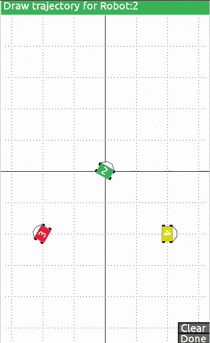
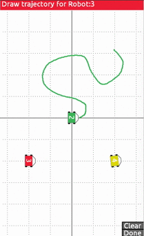

# Robot trajectory tracking

**User-defined path generation :** *COMPLETED*

**L1 Navigation:** *PENDING*

**Obstacle Avoidance:** *PENDING*

### Path Generation:
This code provides a cleaner and more beautiful interface to work with than its MATLAB [equivalent](https://github.com/arunlakshmanan/path-generation). It is written in the [Python](http://py.processing.org/) and blended with [Processing](https://processing.org/) a development environment. It can be used in laboratories to define user-generated trajectories for individual robots. Implementation for swarm robots is still a work in progress.

This is currently on available to *Linux* (Debian) users - I am working on implementing this on other platforms including Windows. Before executing this program, you will need to download the Python module for Processing, which is avaiable in both a [32-bit](http://py.processing.org/processing.py-0202-linux32.tgz) and [64-bit](http://py.processing.org/processing.py-0202-linux64.tgz) versions.

You need to set the following environment variables before you run the script:
```
export PATH=$PATH:/PATH/TO/REPOSITORY/robot-trajectory-tracking
export PATH=$PATH:/PATH/TO/PROCESSING/processing.py-xxxx-linuxvv
```

Write these changes directly to `~/.bashrc` and restart the terminal or source bashrc.

You're all set! Once all your variables have been correctly defined, all you need to do is execute the run script.
```
./run.sh
```
`run.sh` is a bash script that executes the required files, so the user does not need to run each of the files seperately. But the user-defined variables will need to be changed in each python script.

`udps.py` can simulate data instead of your mocap software, which is extremely useful if you need to debug your code before implementing them with real robots.

`pathgen.py`:
Much like it couterpart this code assumes that you are receiving the following motion capture data via [UDP](https://wiki.python.org/moin/UdpCommunication#UDP_Communication):
>1. `x` coordinate location of the robot in meters.
1. `y` coordinate location of the robot in meters.
1. `yaw` or orientation of the robot in radians, using the standard convention.
1. `robot id` specific for each robot.
1. `status`: 1 if tracked or 0 if untracked.
1. `frame` of the mocap data being sent.

Of course, the communication protocol can be changed to allow more variable such as `z`, `pitch`,`roll` to be obtained as well.

Specifications of the motion capture environment - room sizes, robot dimensions and colors can be specified at the beginning of code. And other UI-related customizations such as grid spacing, font sizes, spline smoothness etc. can also be found in the code.

**Functionality:**

1. Real-time reproduction of the scene by the motion capture system:


1. Drawing a trajectory with the cursor with immediate [Catmull-Rom](https://en.wikipedia.org/wiki/Cubic_Hermite_spline#Catmull.E2.80.93Rom_spline) spline interpolation.


1. Clear trajectories whenever you need to and start again.

**Output**: The trajectories generated are stored as a comma seperated values in files, referenced by their `robot id`. *Future work involves using these files for trajectory tracking using L1 navigation.*
